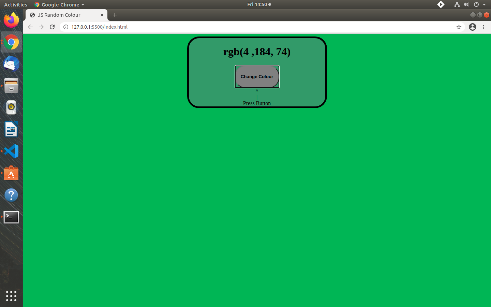

# JS Random Colour

>This project is a basic JavaScript project. The main feature of this app is for users to click the on screen button and the background colour will change to a new random colour. 



# Live Website

https://rawcdn.githack.com/jacobrees/JS-Random-Colour/c40dcb75357477f3162336d767c12a503b736cb7/index.html

# Getting Started

To get a local copy of the repository please run the following commands on your terminal:

```
$ cd <folder>
```

```
$ git clone git@github.com:jacobrees/JS-Random-Colour.git
```


```
$ cd JS-Random-Colour
```

## Built With

- HTML
- CSS
- JavaScript

## Authors

👤 **Jacob Rees**

- Github: [@jacobrees](https://github.com/jacobrees)
- Linkedin: [jacob-rees-a6507b1a6](https://www.linkedin.com/in/jacob-rees-a6507b1a6/)


## 🤝 Contributing

Contributions, issues and feature requests are welcome!

## Show your support

Give a ⭐️ if you like this project!
